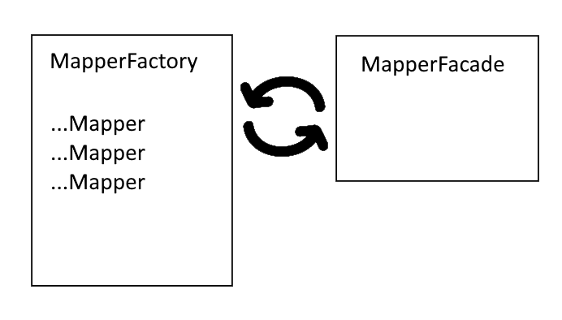

# Orika Mapper

## Описание

*Orika Mapper* - фреймворк для конвертации(маппинга) одних Java бинов в другие, т.е. копирует значения из полей одного объекта в поля другого объекта, если название полей одинаковые.

Данный фреймворк может быть полезен в приложениях с многослойной архитектурой. При конвертации по-умолчанию фреймворк генерирует и использует байт-код, что быстрее чем использование рефлексии.

Простейший пример с https://www.baeldung.com/orika-mapping:

    MapperFactory mapperFactory = new DefaultMapperFactory.Builder().build();

    public class Source {
        private String name;
        private int age;
    
        public Source(String name, int age) {
            this.name = name;
            this.age = age;
        }
    
        // standard getters and setters
    }

    public class Dest {
        private String name;
        private int age;
    
        public Dest(String name, int age) {
            this.name = name;
            this.age = age;
        }
    
        // standard getters and setters
    }

    @Test
    public void givenSrcAndDest_whenMaps_thenCorrect() {
        mapperFactory.classMap(Source.class, Dest.class);
        MapperFacade mapper = mapperFactory.getMapperFacade();
        Source src = new Source("Baeldung", 10);
        Dest dest = mapper.map(src, Dest.class);
    
        assertEquals(dest.getAge(), src.getAge());
        assertEquals(dest.getName(), src.getName());
    }

Поверхностная схема устройства фреймворка:
1. Клиентский код передает исходный объект и конечный класс(дто, которую надо сконвертировать) в **MapperFacade**;
2. **MapperFacade** просит подходящий маппер у **MapperFactory**;
3. **MapperFactory** возвращает уже сгенерированный маппер или генерирует новый;
4. **MapperFacade** конвертирует объект в конечный класс с помощью полученного маппера и возвращает конечный объект клиенту.




## Кастомная конвертация 

На практике чаще всего исходные и конечные объекты не совпадают по структуре: наличие вложенных объектов, несовпадение названий полей, связь одного поля сразу с несколькими. Orika Mapper предлагает несколько способов для кастомной конвертации. Далее рассматриваются несколько из них.

Для работы с фреймворком добавим следующие бины в наше Spring-приложение:

```
    @Bean
    public MapperFactory mapperFactory() {
        return new DefaultMapperFactory.Builder().build();
    }

    @Bean
    public MapperFacade mapperFacade() {
        final MapperFactory mapperFactory = mapperFactory();
        /* здесь добавляем кастомную обработку маппинга */
        return mapperFactory.getMapperFacade();
    }
```

#### Пример 1.
> studentDto.groupName = student.group.groupName

```

public class StudentDto {
    private String firstname;
    private String lastname;
    private String groupName;
}

public class Student {
    private String firstname;
    private String lastname;
    private Group group;
}

    mapperFactory.classMap(Student.class, StudentDto.class)
        .byDefault()
        .field("group.groupName", "groupName")
        .register();

```

#### Пример 2. 
> groupDto.headman = group.headman.firstname + " " + group.headman.lastname

```

public class Group {
    private String groupName;
    private Student headman; // староста
    private List<Student> students;
}

public class GroupDto {
    private String groupName;
    private String headman;
}

    mapperFactory.classMap(Group.class, GroupDto.class)
        .exclude("headman")
        .byDefault()
        .customize(new CustomMapper<Group, GroupDto>() {
            @Override
            public void mapAtoB(Group group, GroupDto groupDto, MappingContext context) {
                groupDto.setHeadman(group.getHeadman().getFirstname() + " " + group.getHeadman().getLastname());
            }
        })
        .register();

```

#### Пример с наследованием.

```

public class GroupWithStudentsDto extends GroupDto {
    List<StudentDto> students;
}

public class GroupDto {
    private String groupName;
    private String headman;
}

public class Group {
    private String groupName;
    private Student headman; // староста
    private List<Student> students;
}

    mapperFactory.classMap(Group.class, GroupWithStudentsDto.class)
        .use(Group.class, GroupDto.class)
        .byDefault()
        .register();

```

### Вопросы для зачета:

1. Каким образом происходит конвертация объектов? (копируется значения по одинаковым полям)

2. Что использует фреймворк для производительности? (байт-код)

3. Где в коде фреймворк может быть полезен? (в многослойных приложениях -- при передаче объектов от сервиса контроллеру)
